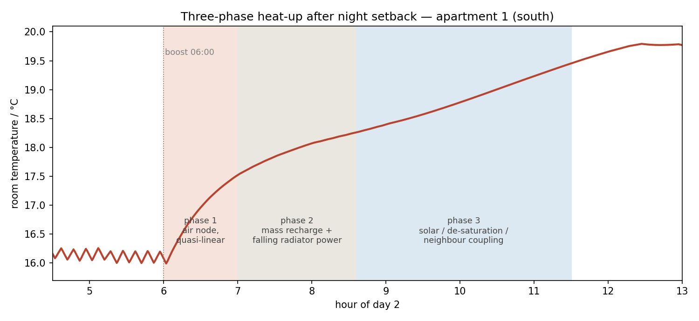
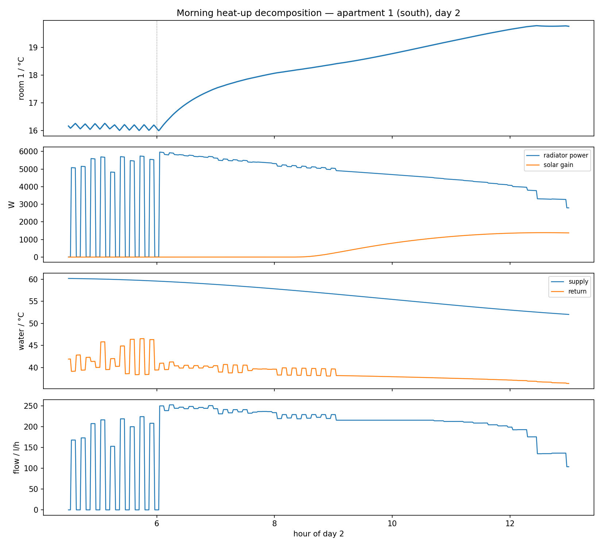
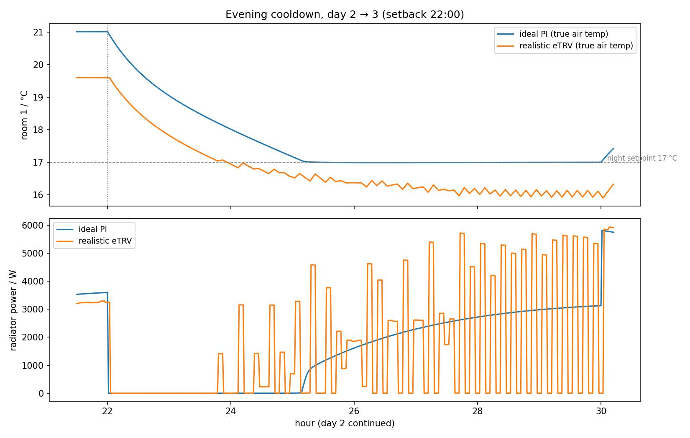

# Heat-up dynamics after setback: why recovery is not exponential

**Observed behavior** (all scenarios, reproducible via `sil/run_heatup_analysis.py`):
after the morning boost the room temperature rises **quasi-linearly**, then
**decelerates** into a knee, and later **re-accelerates** — although the radiator *flow*
is approximately constant throughout. A single-time-constant (exponential) model cannot
produce this shape; the mechanisms below can, and all of them are deliberately present
in the simulator.

*Fig. 1 — Measured room temperature (living room, south, generic building with realistic
eTRVs, day 2) with the three phases discussed below.*

## 0. The premise to discard: constant flow ≠ constant power

Hydronic heat delivery is

$$\dot Q = \dot m \, c_p \, (T_{sup} - T_{ret}),$$

and $T_{ret}$ is a *free* variable set by the radiator's heat exchange with the room. In
the decomposition run, flow settles at ≈ 215-250 l/h from 06:00 while radiator power
falls from ≈ 5.9 kW to 4 kW — the water-side spread collapses as room and return warm
up. (From ≈ 12:00 the eTRV itself starts throttling as the room reaches its perceived
setpoint — the end of the recovery, not part of the constant-flow argument.)

*Fig. 2 — The full decomposition: room temperature (top), radiator power vs solar gain
(second), supply/return temperatures (third), and the approximately constant radiator
flow (bottom). Radiator power decays at constant flow; the phase-3 re-acceleration
coincides with the solar ramp.*

## 1. Phase 1 — quasi-linear rise (air node dominates)

The zone is 2R2C: a fast node — air, furniture and interior surface layers
($C_{air} = 40\,\mathrm{kJ/(m^2K)}$, $\tau_{fast} \approx 41$ min) — and a slow
structural mass node ($C_{mass} = 260\,\mathrm{kJ/(m^2K)}$, ISO 13790 "heavy" class),
coupled by $G_{int}$:

$$C_{air}\dot T_{air} = \dot Q_{conv} + G_{int}(T_{mass}-T_{air}) + G_{win}(T_{out}-T_{air})$$
$$C_{mass}\dot T_{mass} = \dot Q_{rad} + G_{int}(T_{air}-T_{mass}) + G_{wall}(T_{out}-T_{mass})$$

At boost start the radiator output is maximal — the EN 442 law
$\dot Q = \dot Q_{nom}\,(\Delta\theta/\Delta\theta_{nom})^{n}$ with $n = 1.24$
[EN 442-2; Buildings library radiator model] sees the coldest room of the day — and this
peak power initially charges mostly the small $C_{air}$:
$\dot T_{air} \approx \dot Q_{conv}/C_{air}$ ≈ constant → the linear start.

## 2. Phase 2 — deceleration (mass recharge + falling radiator power)

Three compounding, monotone effects:

1. **Structural-mass drain** — as $T_{air}-T_{mass}$ grows, the flux
   $G_{int}(T_{air}-T_{mass})$ diverts an increasing share of the radiator power into the
   cold masonry. The effective capacity transitions from $C_{air}$ toward
   $C_{air}+C_{mass}$ (an order of magnitude larger). This multi-time-constant structure
   of building heat dynamics is the central finding of grey-box identification studies
   ([Bacher & Madsen 2011](https://doi.org/10.1016/j.enbuild.2011.02.005)); recovery-time
   prediction models in the optimal-start literature are quadratic/step-response, not
   single-exponential, for the same reason (Seem 1989; [Armstrong, Hancock & Seem 1992,
   ASHRAE Transactions 98(1)](http://web.mit.edu/parmstr/Public/TC75/A11_Ch42_I-P_SI-2015%20DRAFT-ncmt4.pdf)).
2. **Radiator self-throttling** — the room is warmer ($\Delta\theta{}^{1.24}$ shrinks) and
   the return temperature rises, cutting $\dot Q$ at unchanged flow. The high radiator
   gain at low flows and its consequences for TRV loops are analyzed in
   [Tahersima et al. 2013](https://doi.org/10.1016/j.enbuild.2013.04.019).
3. **Supply-side droop** — outdoor-reset lowers $T_{sup}$ through the morning; in the
   1980s building the two-point burner additionally saturates at $\dot Q_{max}$ while
   *all* TRVs demand maximum, sagging the supply below its curve. DIN EN 12831
   acknowledges exactly this regime with the reheat-capacity supplement $f_{RH}$
   (Aufheizleistung): recovery demand structurally exceeds steady design load. The
   simulator's radiators are accordingly sized 1.3× the naive design load (era
   practice), leaving ≈ 12 % effective reheat margin after the ISO interior coupling —
   enough to complete the 4 K recovery by midday.

## 3. Phase 3 — re-acceleration (external and coupling terms turn positive)

- **Solar gains** (dominant when present): in the decomposition run the south facade
  ramps from 0 to ≈ 1.4 kW between 08:30 and 11:00 — precisely when the room's slope
  picks back up. A free heat source of the same order as the remaining radiator output.
- **Plant de-saturation**: the fastest rooms reach setpoint and their TRVs close; the
  freed boiler capacity restores supply temperature for the lagging rooms (visible in
  solar-free recovery runs, cf. the balancing fairness test).
- **Neighbor coupling sign reversal**: once adjacent rooms and slabs are warm, the
  inter-zone conduction terms $G_{vert}, G_{door}$ stop draining the room — late in
  recovery they may even feed it.
- **Mass saturation**: as $T_{mass} \to T_{air}$ the drain of phase 2 fades (this alone
  only flattens the curve; combined with the positive terms above it re-accelerates).

## 4. Implication for control research

Naive optimal-start algorithms extrapolate the phase-1 slope and systematically
under-predict recovery time (they miss the mass-recharge plateau); measurement-driven
algorithms trained on full recoveries (Seem/Armstrong lineage, modern MPC) handle the
multi-time-constant shape. The simulator reproduces all three phases with their true
causes, so optimal-start and coordination strategies developed against it face the same
prediction problem as in the field — including its exploitable structure (clear-sky
forecasts predict phase-3 solar; valve-position feedback predicts plant de-saturation).

## 5. The mirror image: evening cooldown

The cooldown after setback shows the same two-node structure in reverse
(`sil/run_cooldown_analysis.py`):

*Fig. 3 — Room temperature and radiator power after the 22:00 setback. The ideal PI
free-cools for ≈ 3 h before re-engaging at the night setpoint; the realistic eTRV
glides ≈ 1 K lower (sensor bias) with relay-style night cycling.*

| Window after setback | Rate | Mechanism |
|---|---|---|
| first hour | −1.8 K/h | **air-node fast phase**: with the valve shut, the fast node relaxes with $\tau \approx 41\,$min toward the still-warm mass; predicted sag ≈ $\frac{G_{win}}{G_{win}+G_{int}}(T_{mass}-T_{out}) \approx 1$ K below the mass node |
| hours 2-3 | −0.57 K/h | transition: air slaved to the slowly cooling structure |
| rest of night | −0.14 K/h | **not free cooling** — the thermostat holds the night setpoint with rising trickle/cycling power; pure structural cooling would be ≈ −0.5 K/h initially |

The apparent "fast cooldown" is therefore the *air separating from the structure*, not
the building losing its stored heat — the masonry cools an order of magnitude slower.
Two model notes: (i) the rooms are **not empty** — $C_{air}$ = 40 kJ/(m²K) ≈ 13× bare
air lumps furniture, contents and the interior surface layers that move with the air
(EnergyPlus zone-capacitance-multiplier practice 1-20; ISO 52016 surface-layer
capacitance; empty-room assumptions distort dynamic simulations —
[Johra & Heiselberg 2017](https://doi.org/10.1016/j.rser.2016.11.145));
(ii) the air↔surface coupling follows the ISO 13790 convention
$h_{is}·A_t = 3.45\,\mathrm{W/(m^2K)} \times 4.5·A_{floor}$. Both were calibrated after
this analysis: the coupling raises the steady heat load to 65 W/m²
(building80s-parameters.md §6), and the fast-node capacity sets
$\tau_{fast} \approx 41$ min, inside the 0.5-2 h corridor that grey-box identification
finds for furnished rooms.

## References

- P.R. Armstrong, C.E. Hancock, J.E. Seem: *Commercial Building Temperature Recovery —
  Part I: Design Procedure Based on a Step Response Model*, ASHRAE Transactions 98(1), 1992.
- J.E. Seem: *Modeling of Heat Transfer in Buildings* (CRTF), PhD thesis, UW-Madison, 1987 /
  ASHRAE 1989.
- P. Bacher, H. Madsen: *Identifying suitable models for the heat dynamics of buildings*,
  Energy and Buildings 43 (2011) 1511-1522. [doi:10.1016/j.enbuild.2011.02.005](https://doi.org/10.1016/j.enbuild.2011.02.005)
- F. Tahersima, J. Stoustrup, H. Rasmussen: *An analytical solution for
  stability-performance dilemma of hydronic radiators*, Energy and Buildings 64 (2013).
  [doi:10.1016/j.enbuild.2013.04.019](https://doi.org/10.1016/j.enbuild.2013.04.019)
- EN 442-2: *Radiators and convectors — Test methods and rating*; radiator model:
  [Buildings.Fluid.HeatExchangers.Radiators.RadiatorEN442_2](https://simulationresearch.lbl.gov/modelica/releases/latest/help/Buildings_Fluid_HeatExchangers_Radiators.html).
- DIN EN 12831-1: *Heizungsanlagen in Gebäuden — Verfahren zur Berechnung der
  Norm-Heizlast* (reheat capacity supplement $f_{RH}$).
- ISO 13790 / DIN EN ISO 52016: thermal capacity classes (heavy: 260 kJ/(m²K)).
