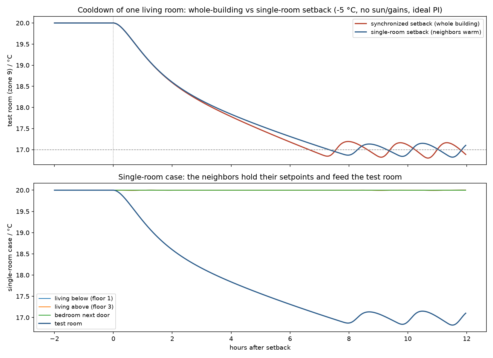

# Heat-up dynamics after setback: why recovery is not exponential

**Observed behavior** (all scenarios, reproducible via `sil/run_heatup_analysis.py`):
after the morning boost the room temperature rises **quasi-linearly**, then
**decelerates** into a knee, and later **re-accelerates** — although the radiator *flow*
is approximately constant throughout. A single-time-constant (exponential) model cannot
produce this shape; the mechanisms below can, and all of them are deliberately present
in the simulator.

*Fig. 1 — Measured room temperature (living room, south, generic building with realistic
eTRVs, day 2) with the three phases discussed below.*

## 0. The premise to discard: constant flow ≠ constant power

Hydronic heat delivery is

$$\dot Q = \dot m \, c_p \, (T_{sup} - T_{ret}),$$

and $T_{ret}$ is a *free* variable set by the radiator's heat exchange with the room. In
the decomposition run, flow settles at ≈ 215-250 l/h from 06:00 while radiator power
falls from ≈ 5.9 kW to 4 kW — the water-side spread collapses as room and return warm
up. (From ≈ 12:00 the eTRV itself starts throttling as the room reaches its perceived
setpoint — the end of the recovery, not part of the constant-flow argument.)

*Fig. 2 — The full decomposition: room temperature (top), radiator power vs solar gain
(second), supply/return temperatures (third), and the approximately constant radiator
flow (bottom). Radiator power decays at constant flow; the phase-3 re-acceleration
coincides with the solar ramp.*

## 1. Phase 1 — quasi-linear rise (air node dominates)

The zone is 2R2C: a fast node — air, furniture and interior surface layers
($C_{air} = 40\,\mathrm{kJ/(m^2K)}$, $\tau_{fast} \approx 41$ min) — and a slow
structural mass node ($C_{mass} = 450\,\mathrm{kJ/(m^2K)}$, the night-accessible
capacity of masonry + concrete-slab construction, see §6),
coupled by $G_{int}$:

$$C_{air}\dot T_{air} = \dot Q_{conv} + G_{int}(T_{mass}-T_{air}) + G_{win}(T_{out}-T_{air})$$
$$C_{mass}\dot T_{mass} = \dot Q_{rad} + G_{int}(T_{air}-T_{mass}) + G_{wall}(T_{out}-T_{mass})$$

At boost start the radiator output climbs to its maximum within ≈ 20-30 min (the
water/steel storage must recharge first — the short S-start at 06:00) — the EN 442 law
$\dot Q = \dot Q_{nom}\,(\Delta\theta/\Delta\theta_{nom})^{n}$ with $n = 1.24$
[EN 442-2; Buildings library radiator model] sees the coldest room of the day — and this
peak power initially charges mostly the small $C_{air}$:
$\dot T_{air} \approx \dot Q_{conv}/C_{air}$ ≈ constant → the linear start.

## 2. Phase 2 — deceleration (mass recharge + falling radiator power)

Three compounding, monotone effects:

1. **Structural-mass drain** — as $T_{air}-T_{mass}$ grows, the flux
   $G_{int}(T_{air}-T_{mass})$ diverts an increasing share of the radiator power into the
   cold masonry. The effective capacity transitions from $C_{air}$ toward
   $C_{air}+C_{mass}$ (an order of magnitude larger). This multi-time-constant structure
   of building heat dynamics is the central finding of grey-box identification studies
   ([Bacher & Madsen 2011](https://doi.org/10.1016/j.enbuild.2011.02.005)); recovery-time
   prediction models in the optimal-start literature are quadratic/step-response, not
   single-exponential, for the same reason (Seem 1989; [Armstrong, Hancock & Seem 1992,
   ASHRAE Transactions 98(1)](http://web.mit.edu/parmstr/Public/TC75/A11_Ch42_I-P_SI-2015%20DRAFT-ncmt4.pdf)).
2. **Radiator self-throttling** — the room is warmer ($\Delta\theta{}^{1.24}$ shrinks) and
   the return temperature rises, cutting $\dot Q$ at unchanged flow. The high radiator
   gain at low flows and its consequences for TRV loops are analyzed in
   [Tahersima et al. 2013](https://doi.org/10.1016/j.enbuild.2013.04.019).
3. **Supply-side droop** — outdoor-reset lowers $T_{sup}$ through the morning; in the
   1980s building the two-point burner additionally saturates at $\dot Q_{max}$ while
   *all* TRVs demand maximum, sagging the supply below its curve. DIN EN 12831
   acknowledges exactly this regime with the reheat-capacity supplement $f_{RH}$
   (Aufheizleistung): recovery demand structurally exceeds steady design load. The
   simulator carries both era answers: radiators sized 1.3× the naive design load,
   and a **Schnellaufheizung** supervisory boost (`sil/boiler.py`: +12 K on the
   heating curve inside a morning window until the rooms recover — DIN 4702-8-era
   Aufheizoptimierung). With the boost, the bulk of a 3 K recovery completes within
   ≈ 1 h; without it, the calibrated night mass would stretch recovery past 5 h.

## 3. Phase 3 — re-acceleration (external and coupling terms turn positive)

- **Solar gains** (dominant when present): in the decomposition run the south facade
  ramps from 0 to ≈ 1.4 kW between 08:30 and 11:00 — precisely when the room's slope
  picks back up. A free heat source of the same order as the remaining radiator output.
- **Plant de-saturation**: the fastest rooms reach setpoint and their TRVs close; the
  freed boiler capacity restores supply temperature for the lagging rooms (visible in
  solar-free recovery runs, cf. the balancing fairness test).
- **Neighbor coupling sign reversal**: once adjacent rooms and slabs are warm, the
  inter-zone conduction terms $G_{vert}, G_{door}$ stop draining the room — late in
  recovery they may even feed it.
- **Mass saturation**: as $T_{mass} \to T_{air}$ the drain of phase 2 fades (this alone
  only flattens the curve; combined with the positive terms above it re-accelerates).

At the *end* of recovery the radiator storage produces the field-typical **setpoint
overshoot**: rooms that arrive while their radiator is still hot coast past the
setpoint — the stored heat is on the room side of the valve (radiator-modeling.md §3).
Enabling the storage raised the overheating KPI by ≈ 25 % (ideal PI) and ≈ 40 %
(realistic eTRV) in the comparison run (measured at the pre-calibration
C_mass = 260; the effect persists at 450, amplified by the boost's hotter radiators).

## 4. Implication for control research

Naive optimal-start algorithms extrapolate the phase-1 slope and systematically
under-predict recovery time (they miss the mass-recharge plateau); measurement-driven
algorithms trained on full recoveries (Seem/Armstrong lineage, modern MPC) handle the
multi-time-constant shape. The simulator reproduces all three phases with their true
causes, so optimal-start and coordination strategies developed against it face the same
prediction problem as in the field — including its exploitable structure (clear-sky
forecasts predict phase-3 solar; valve-position feedback predicts plant de-saturation).

## 5. The mirror image: evening cooldown

The cooldown after setback shows the same two-node structure in reverse
(`sil/run_cooldown_analysis.py`):

*Fig. 3 — Room temperature and radiator power after the 22:00 setback. The radiator
power decays over ≈ 1.5 h (stored water/steel heat) instead of stopping with the valve;
the ideal PI free-cools for ≈ 6 h before re-engaging at the night setpoint — with a
slight undershoot-and-wobble, the PI fighting the emission lag; the realistic eTRV
glides ≈ 0.5-1 K lower (sensor bias) with slow charge/discharge night cycles.*

| Window after setback | Rate | Mechanism |
|---|---|---|
| first hour | −1.40 K/h | **cushioned air-node fast phase**: the fast node relaxes with $\tau \approx 41\,$min, but the radiator/riser storage keeps feeding the room |
| hours 2-3 | −0.67 K/h | transition: the storage is spent; the delayed descent catches up, air slaved to the slowly cooling structure |
| rest of night | −0.12 K/h | **not free cooling** — the thermostat holds the night setpoint with rising trickle/cycling power |

The apparent "fast cooldown" is therefore the *air separating from the structure*, not
the building losing its stored heat — the masonry cools an order of magnitude slower.
Two model notes: (i) the rooms are **not empty** — $C_{air}$ = 40 kJ/(m²K) ≈ 13× bare
air lumps furniture, contents and the interior surface layers that move with the air
(EnergyPlus zone-capacitance-multiplier practice 1-20; ISO 52016 surface-layer
capacitance; empty-room assumptions distort dynamic simulations —
[Johra & Heiselberg 2017](https://doi.org/10.1016/j.rser.2016.11.145));
(ii) the air↔surface coupling follows the ISO 13790 convention
$h_{is}·A_t = 3.45\,\mathrm{W/(m^2K)} \times 4.5·A_{floor}$. Both were calibrated after
this analysis: the coupling raises the steady heat load to 65 W/m²
(building80s-parameters.md §6), and the fast-node capacity sets
$\tau_{fast} \approx 41$ min, inside the 0.5-2 h corridor that grey-box identification
finds for furnished rooms.

## 6. Resolved: the absolute cooldown rate vs field records

Field recordings in this building class show two signatures: setpoint **overshoot**
after recovery (reproduced since the radiator storage exists,
radiator-modeling.md §3) and **overnight cooling of only ≈ 0.2-0.4 K/h**. The second
one is calibrated as of the night-mass revision. Measured on the era-accurate
Building80s under a clean protocol (`sil/run_neighbor_test.py`: 48 h verified
warm-up at setpoint, 3 K setback of a mid-floor south living room, −5 °C, no sun,
no gains, ideal PI):

| Quantity | Before (C_mass = 260) | **Calibrated (C_mass = 450)** | Field |
|---|---|---|---|
| First-hour rate | −0.79 K/h | **−0.77 K/h** (the fast-phase knee — field curves show it too) | ≈ −0.5…−1 K/h knee |
| Free-cool tail (h 4-8) | −0.44 K/h | **−0.25 K/h** | ≈ −0.2…−0.4 K/h |
| 3 K setback consumed after | ≈ 5.5 h | **≈ 7-8 h** (8-h drop 2.81 K) | typically most of a night |

With the Schnellaufheizung boost the *morning* recovery does its bulk work
(≈ 2 K) within the first hour — the field-typical asymmetry (heat-up fast,
cooldown several times longer) is a **power** phenomenon, not a network
property: linear RC time constants are direction-symmetric, and the calibration
study (`sil/calibrate_deep_mass.py`) shows recovery time becomes nearly
independent of the zone mass once boost power exceeds ≈ 2.3 kW per room-set.

**The investigation that led here — hypotheses tested and eliminated:**

1. *Cold-started structure* — no: both zone nodes initialize at 20 °C and the
   protocol verifies 20.00 °C / 1059 W at the setback instant after 48 h warm-up.
2. *Synchronized whole-building setback vs the field's warm neighbors* — no: at
   the original capacity the 8-h cooldown changed by only **0.04 K** with all
   neighbors held at 20.0 °C. The slab/door couplings act between the slow mass
   nodes, which barely diverge within a night. (At the calibrated capacity the
   cooling is slow enough that the neighbor feed finally becomes visible —
   the single-room case reaches the night setpoint ≈ 1 h later, Fig. 4 — but it
   was never the factor-2 effect.)
3. *Missing radiator storage* — resolved earlier; it is what already cushions the
   first hour and creates the ±0.2 K / ≈ 1.5 h PI limit cycle at the night
   setpoint visible in Fig. 4.

*Fig. 4 — Whole-building vs single-room setback: the test-room trajectories are
practically identical; bottom: the neighbors hold 20.0 °C while the test room falls.*

**Why the room can only be as slow as the mass node:** after the fast phase the air
hangs $G_{win}/(G_{win}+G_{int}) \approx 4$-$7\,\%$ of $(T_{mass}-T_{out})$ — i.e.
1-1.6 K — below the mass node and then tracks it. The relevant time constants
(80s living room, calibrated): air relaxation 41 min; **mass→room discharge**
$C_{mass}/G_{int} \approx$ **8.1 h** (not the bottleneck); passive structure
cooling $(C_{air}+C_{mass})/(G_{win}+G_{wall}) \approx$ **79 h** → tail rate
$\approx 25\,\mathrm{K}/79\,\mathrm{h} \approx 0.3$ K/h ✓ corridor.

**Resolution — the night-participating capacity, not a weakly-coupled extra node:**
the calibration study (`sil/calibrate_deep_mass.py`) first showed that a dead-end
"deep mass" third node behind a few W/(m²K) is a **null result** (< 0.6 K change in
the 8-h drop across the physical parameter range — it can only absorb heat as fast
as the mass node falls below it). The corridor requires *strongly coupled*
capacity: $C_{mass}$ was raised 260 → **450 kJ/(m²K)·A** — the night-accessible
capacity of this construction by bottom-up inventory (two half-thickness concrete
slabs ≈ 430 kJ/m²K alone; heat penetrates $\sqrt{a t} \approx 14$ cm of masonry in
8 h), matching DIN V 18599-2 (heavy class: 468 kJ/m²K floor-referenced) and
DIN V 4108-6 (≈ 560). The ISO 13790 class value (heavy, 260) is a monthly-method
convention that sits far too low for massive construction — it was the single
cause of the 2× overnight discrepancy. The derivation and its side effects were
adversarially verified (independent RK4 re-derivation; norm/literature check;
repo audit confirming steady states and balancing presets are capacity-invariant).

## References

- P.R. Armstrong, C.E. Hancock, J.E. Seem: *Commercial Building Temperature Recovery —
  Part I: Design Procedure Based on a Step Response Model*, ASHRAE Transactions 98(1), 1992.
- J.E. Seem: *Modeling of Heat Transfer in Buildings* (CRTF), PhD thesis, UW-Madison, 1987 /
  ASHRAE 1989.
- P. Bacher, H. Madsen: *Identifying suitable models for the heat dynamics of buildings*,
  Energy and Buildings 43 (2011) 1511-1522. [doi:10.1016/j.enbuild.2011.02.005](https://doi.org/10.1016/j.enbuild.2011.02.005)
- F. Tahersima, J. Stoustrup, H. Rasmussen: *An analytical solution for
  stability-performance dilemma of hydronic radiators*, Energy and Buildings 64 (2013).
  [doi:10.1016/j.enbuild.2013.04.019](https://doi.org/10.1016/j.enbuild.2013.04.019)
- EN 442-2: *Radiators and convectors — Test methods and rating*; radiator model:
  [Buildings.Fluid.HeatExchangers.Radiators.RadiatorEN442_2](https://simulationresearch.lbl.gov/modelica/releases/latest/help/Buildings_Fluid_HeatExchangers_Radiators.html).
- DIN EN 12831-1: *Heizungsanlagen in Gebäuden — Verfahren zur Berechnung der
  Norm-Heizlast* (reheat capacity supplement $f_{RH}$).
- ISO 13790 / DIN EN ISO 52016: thermal capacity classes (heavy: 260 kJ/(m²K)).
