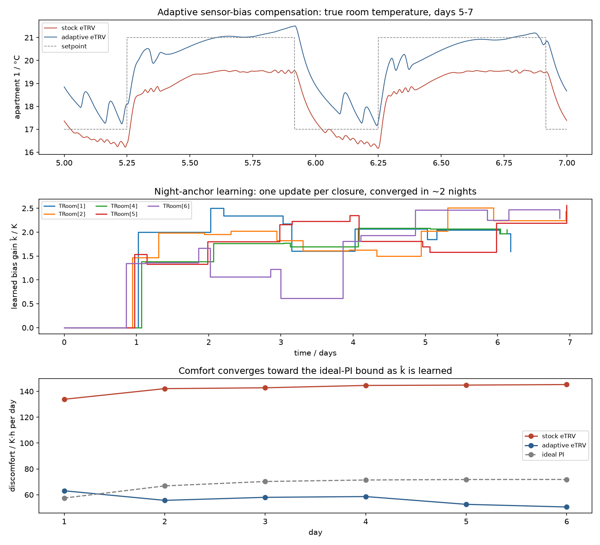
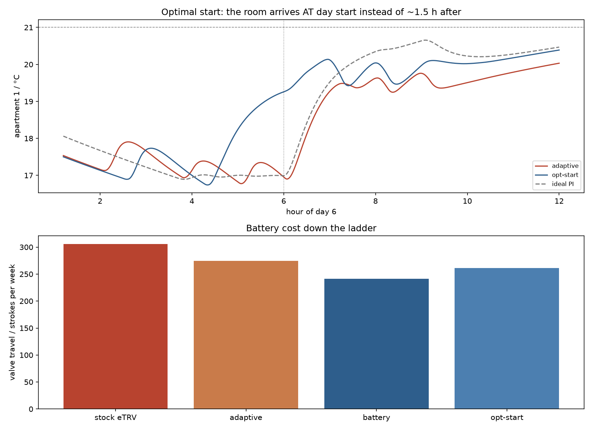
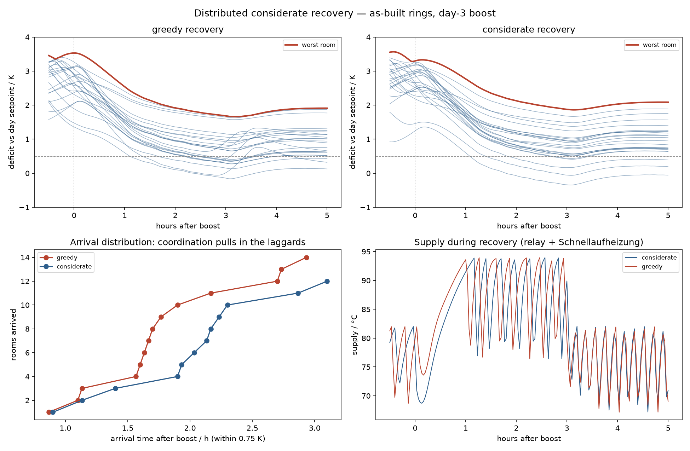
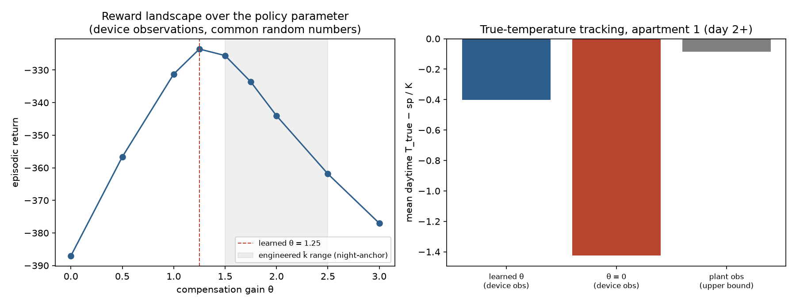

# Phase 3 — Adaptive eTRV control strategies: results

> *Developed with Claude Code (Anthropic) as a coding agent under human
> direction — see the AI-assisted development disclaimer in the
> [README](../README.md).*

The research phase this simulator was built for: can the comfort and battery
penalties of realistic electronic radiator thermostats be recovered by better
firmware — individually (adaptive) and collectively (distributed)? Four
strategies were built as a **cumulative ladder**, each evaluated on the
identical scenario against two fixed baselines, and one distributed strategy
was taken through a five-round experiment on the room-resolved 1980s building.

**Ground rules.** Every strategy is pure firmware: a device sees only its own
sampled (300 s), quantized (0.1 K), radiator-biased sensor, its own commanded
position, and the clock (`sil/thermostat.py`). Distributed strategies may
additionally use the hub broadcast channel that commercial eTRV ecosystems
provide (a shared blackboard, no central intelligence). Nothing reads
plant-side signals.

**Baselines** (generic 6-apartment building, 7-day winter with solar and
occupancy schedules, two-point-free supply with Schnellaufheizung boost,
`sil/run_thermostat_comparison.py`):

- *ideal PI* — a hardware-free controller reading the true room temperature:
  the upper bound no device can beat;
- *stock eTRV* — the full device-pathology model: valve-mounted sensor bias,
  sampling, deadband, backlash, quick-opening insert.

## 1. The ladder at a glance

| KPI (days 2–7) | ideal PI | stock eTRV | + bias comp | + battery | + opt-start |
|---|---|---|---|---|---|
| Discomfort (K·h) | 409.7 | 853.5 | 338.6 | 378.5 | **230.9** |
| Overheating (K·h) | 137.2 | 52.9 | 166.5 | 155.1 | 209.2 |
| Discomfort + overheating | 546.9 | 906.4 | 505.1 | 533.6 | **440.1** |
| Boiler energy (kWh) | 1988.7 | 1902.0 | 2045.6 | 2036.3 | 2078.4 |
| Valve travel (strokes/wk) | — | 305.8 | 251.7 | **215.3** | 219.5 |
| Valve moves (count/wk) | — | 3108 | 1624 | **972** | 1042 |

Three firmware upgrades take a realistic eTRV from **double** the ideal-PI
comfort penalty to **beyond** it, while cutting the battery-relevant move
count to a third. Two honesty notes on "beating" the ideal PI:

- *Metric asymmetry.* The discomfort KPI is one-sided (below setpoint). The
  compensated device settles with a small warm offset (its conservative
  estimator under-corrects, but the deadband lets it ride ~0.1–0.2 K high),
  which the one-sided metric rewards; the symmetric sum row and the
  overheating row keep that visible (+29 K·h overheating vs the ideal PI at
  rung 1).
- *Schedule anticipation is a real win.* The ideal-PI baseline runs the same
  schedule with no lead; optimal start removes the morning-recovery deficit
  that dominates the ideal PI's own 409.7 K·h — a capability, not an
  artifact — and pays for it in pre-start overheating (209.2 K·h) and
  +4.5 % boiler energy, both on the table.

Every rung exploits a physical time scale verified earlier in the project:

| Strategy | Exploited physics | Where verified |
|---|---|---|
| Bias compensation | sensor-bias decay (τ ≈ 10 min) vs calibrated room cooling (−0.25 K/h) — separable at closures | heatup-dynamics.md §6 |
| Battery policies | radiator storage still arriving after a close (τ_e ≈ 30–50 min); quick-opening stroke resolution | radiator-modeling.md §3, valve-modeling.md |
| Optimal start | multi-time-constant recovery no single slope predicts | heatup-dynamics.md §§1–4 |
| Considerate recovery | riser interaction: flow at fixed opening is a ±29 % band | valve-modeling.md §3 |

## 2. Rung 1 — adaptive sensor-bias compensation

The valve-mounted sensor reads high while the radiator is hot; the stock
device chronically holds the room ~1–1.5 K below setpoint — the dominant
penalty. The firmware cannot see the bias, but it can *catch it in the act*:
at every long valve closure the bias decays within tens of minutes while the
calibrated room loses only ~0.2 K/h. The excess sensed-temperature drop over
the closure is the bias that was present; one gain update per closure
(`BiasCompensatingThermostat`, `sil/strategies.py`). Compensation is applied
through a lag-filtered heat proxy computed from the device's own commanded
opening via the known quick-opening insert shape.

*Fig. 1 — Top: true room temperature, stock vs adaptive, days 5–7 (the stock
plateau sits 1.5 K under setpoint; the adaptive one straddles it). Middle:
the learned gain — factory prior 1.0, anchors keeping it in a 1.4–2.5 band.
Bottom: per-day discomfort falling past the ideal-PI curve as learning
progresses (see the metric notes in §1).*

Result: discomfort **853.5 → 338.6 K·h** with travel *down* (compensation
reduces hunting: 305.8 → 251.7 strokes, 3108 → 1624 moves) and the energy
cost on display (+2.9 % vs the ideal PI — rooms actually held at setpoint).

## 3. Rung 2 — battery-aware limit-cycle suppression

Two policies against the night cycling that burns valve travel:
a **comfort-scaled deadband** (near setpoint a move must be worth 15 % of
stroke instead of 5 % — fine positioning there is futile anyway, the insert
squeezes all resolution into ~0.5 mm and the radiator storage low-passes the
result) and a **reopen dwell** (after closing, no reopen for 15 min unless
the room is genuinely cold: the radiator's stored heat is still arriving).

Result: **moves down 40 %** (1624 → 972), travel 251.7 → 215.3 strokes/week,
for +39.9 K·h discomfort.

## 4. Rung 3 — per-room adaptive optimal start

The stock device reacts to the morning setpoint step and arrives 1–2 h late
(the multi-time-constant recovery documented in heatup-dynamics.md). This
firmware advances its own setpoint step by a lead time learned from each
morning's measured arrival on its *own compensated sensor* — bounded updates,
solar-crossing guard, the central boost simply absorbed into the learned lead.

*Fig. 2 — Top: day-6 morning; the optimal-start device begins climbing at
~04:30 and crosses the day-start line at 19.3 °C, arriving with the boosted
ideal PI, while the previous rung is still 2 K away. Bottom: valve travel
down the ladder.*

Leads converge per room and per usage pattern: the long-day south living
rooms climb to ≈ 130 min, the mid apartments settle at 65–85 min. Full-ladder
discomfort: **230.9 K·h**, symmetric sum 440.1 vs the ideal PI's 546.9 — the
anticipation win minus its overheating cost.

## 5. Rung 4 — distributed considerate recovery (a documented negative)

**Question:** in the as-built 1980s building (scattered presetting rings,
43 % flow deviation), greedy morning recovery lets hydraulically favored
rooms starve the weak ones. Can arrived devices *yield* — cap their opening
during contention, freeing differential pressure for laggards — coordinated
only through the hub blackboard (`RecoveryCoordinator`)?

**Five experiment rounds** (`sil/run_coordinated_recovery.py`, Building80s,
as-built rings, whole-building setback, day-6 boost, greedy vs considerate
with identical seeds), each round a finding:

1. **The bias floor drowns fairness metrics.** Devices satisfied on biased
   sensors never truly arrive; no threshold is reachable. Fairness can only
   be measured above converged bias learning.
2. **The radiator storage corrupts the anchor.** The valve body tracks the
   stored-heat discharge (τ_e ≈ 30–50 min), so identification windows sized
   to the 600 s sensor lag learn k̂ ≈ 0 on 90/70 era radiators. *The same
   radiators that are hardest to control are hardest to calibrate against* —
   the most transferable finding of the phase for real firmware.
3. **Unconditional yielding is fragile.** One never-arriving peer (a device
   that could not learn) keeps the whole swarm capped all day. Coordination
   needs contention windows.
4. **Identification must work on partial decays.** Fast-cooling rooms reopen
   ~2–2.5 h after setback and never grant a settling wait. The final
   estimator: three equal windows over whatever closure exists — the window
   drops form a geometric sequence in the bias decay, so the bias at closure
   is recoverable (Prony-style); window edges averaged against the 0.1 K
   quantization; the S-shaped double-lag flat top skipped and
   back-extrapolated with the measured decay ratio. Verified by a two-plant
   unit probe (`sil/test_strategies.py`) including a 1.5 h partial closure.
5. **A factory prior closes the tail.** One bath's usage pattern never
   grants a usable closure; devices now ship k̂ = 1.0 and refine.
6. **Over-identification is the opposite failure.** Re-evaluating the ladder
   exposed that the back-extrapolation step of round 4 systematically
   over-estimated the bias: the zone fast node relaxes with τ ≈ 41 min —
   spectrally indistinguishable from the bias decay inside a closure — so
   part of the room's own sag is inevitably booked as bias, and amplifying
   it drove every k̂ into the clamp and the rooms ~1 K *above* setpoint
   (which the one-sided discomfort metric silently rewarded). The final
   estimator deliberately under-corrects (~30 %): a small residual
   undershoot is the safe failure mode; over-compensation burns energy
   invisibly.

**Verdict** (final firmware, honest calibration: k̂ median ≈ 1.5, no clamp
saturation): **greedy beats considerate on every metric** (worst room at
+3 h: 1.68 vs 1.87 K; spread 1.83 vs 2.21 K; arrivals within 0.75 K: 14 vs
12) — the boosted, 1.3×-sized plant resolves the contention itself, and
capping arrived rooms only delays them. The apparent hydraulic fairness
problem of the early rounds was residual sensor bias in disguise. The policy
is retained as a documented negative result; it would pay only in plants
without reheat margin (no boost, no oversizing), where recovery contention
is genuinely binding.

*Fig. 3 — Final round: per-room deficit trajectories and arrival
distributions, greedy vs considerate, plus the supply relay/boost traces
confirming both variants saw identical plant behavior.*

The hydraulic interaction the strategy targeted is real and quantified — the
installed valve characteristic in operation is a **band** (±45 % flow at the
working stroke, flow collapse at unchanged opening when the neighbours open
at the boost; valve-modeling.md §3, `scripts/make_flow_evidence.py`) — it is
simply not the binding constraint of this building's recoveries once sensing
is healthy.

## 6. What Phase 3 established

1. **The device penalty is fully recoverable in firmware.** No hardware
   change: the comfort gap to the same-schedule ideal PI is closed (and
   exceeded via schedule anticipation), moves cut to a third, all trades
   explicit.
2. **Every effective strategy is a physics exploit.** The ladder worked
   because each rung leaned on a verified, documented time scale — and the
   one strategy that ignored where the bottleneck actually was (rung 4)
   returned a negative.
3. **Identifiability is a plant property — in both directions.** Sensor-bias
   learning lives or dies by the radiator's thermal storage and the room's
   usage pattern (under-identification, rounds 2/4/5), and the zone fast
   node's overlapping time constant puts a hard ceiling on how much a
   single-sensor estimator may trust itself (over-identification, round 6).
   Robust estimators — partial-decay identification, factory priors,
   deliberate under-correction — are mandatory, not optional.
4. **Watch the metric as closely as the physics.** The one-sided discomfort
   KPI silently rewarded over-compensation (rooms held warm read as
   "comfort"); the paired overheating and energy rows exposed it. Symmetric
   sums and cost rows belong in every comparison table.

All numbers in this document are measured with the final firmware
(conservative three-window estimator, factory prior) — one consistent
revision across all four rungs.

## 7. Postscript: can RL learn the compensation? (yes)

With the gym environment's device-observation mode in place, the question
became testable: an agent rewarded on **true** comfort but observing only the
biased sensor — the partially observed setting a real deployment lives in
minus the reward oracle. The FMU sample budget (~10 min per episode) rules
out deep RL, so the simplest honest formulation was used: derivative-free
episodic policy search over a structured policy — per-zone PI on
$T_{sensed} - \theta\,u_{filt}$ with the heat-proxy feature given and only
the gain $\theta$ learned from reward (`sil/run_rl_bias.py`, 12 episodes
total, common random numbers across candidates).

*Fig. 4 — Left: the reward landscape over θ is smooth and single-peaked;
the learned optimum (θ = 1.25) sits at the lower edge of the engineered
night-anchor's k̂ range. Right: true-temperature tracking — the learned
policy recovers ≈ 90 % of the observability gap to the plant-observation
bound (−0.40 K vs −1.42 K uncompensated vs −0.08 K).*

Three observations:

1. **The compensation is learnable from reward alone** — no anchor
   cleverness, no closure detection: twelve episodes of blind search find
   the gain the engineered firmware needed identifiability analysis to
   estimate.
2. **The reward architecture avoids the over-compensation trap
   automatically**: the energy term rises monotonically with θ (533 → 637
   kWh across the grid), so the optimum sits slightly *below* the
   bias-neutral gain — the same conservative lesson the engineered
   estimator had to learn the hard way (§5, round 6) emerges from the
   reward structure for free.
3. **The two approaches are complementary, not competing**: the RL route
   needs the true-comfort reward (a luxury of simulation — unmeasurable in
   a real flat); the night-anchor needs only device-local data but pays in
   estimator complexity. A field-ready synthesis would train θ in
   simulation and refine with anchors in situ.

## 8. Postscript II: the ladder on a foreign plant (BOPTEST)

Every number above is measured on our own plant models — so it could, in
principle, be an artifact of our building physics or our KPI definitions.
It is not. The same firmware objects, unretuned with factory priors, were
run against the independent [BOPTEST](https://ibpsa.github.io/project1-boptest/)
reference plant `multizone_residential_hydronic` (five valve zones, gas
boiler, `peak_heat_day` scenario), scored by BOPTEST's own KPIs
(full method and results: [boptest-benchmark.md](boptest-benchmark.md)):

| case | tdis_tot [K·h/zone] | ener_tot [kWh/m²] |
|---|---:|---:|
| plain PI (true temp) | 25.5 | 8.23 |
| stock eTRV | 69.7 | 8.06 |
| ladder eTRV (rung 2 firmware) | 52.0 | 8.23 |

Two findings transfer, one gets sharpened:

1. **The pathology reproduces** — the stock firmware costs 2.7× the PI
   discomfort for a 2 % energy saving (here: 2.1×).
2. **The metric caveat resolves in the ladder's favor.** BOPTEST's
   discomfort KPI is *two-sided* — exactly the symmetric metric finding 4
   above calls for — and the ladder still removes 40 % of the pathology gap
   at PI-equal energy. The recovery is not a warm-side artifact of our
   one-sided KPI.
3. **Finding 1 gets its honest boundary condition.** "Fully recoverable"
   holds on the plant the firmware's priors were shaped by; on a foreign
   plant, scored from scenario start (learning nights included) with the
   estimator's deliberate under-correction transferred as-is, recovery is
   partial (40 %). Closing the rest is a matter of in-situ adaptation time
   and per-plant priors — the field-deployment question.

## Reproduction

| Result | Script |
|---|---|
| Ladder rung 1 | `sil/run_adaptive_bias.py` |
| Ladder rungs 2–3 + table | `sil/run_strategy_ladder.py` |
| Rung 4 fairness experiment | `sil/run_coordinated_recovery.py` |
| Estimator unit probe | `sil/test_strategies.py` |
| Opening-vs-flow evidence | `scripts/make_flow_evidence.py` |
| RL bias-compensation search | `sil/run_rl_bias.py` |
| BOPTEST cross-plant benchmark | `sil/run_boptest_benchmark.py` |

All runs land in the run store (`runs/`) and the leaderboard; baselines are
the `cmp_ideal` / `cmp_realistic` runs of `sil/run_thermostat_comparison.py`.

## References

- Device model and constraints: [thermostat.py](../sil/thermostat.py),
  [valve-modeling.md](valve-modeling.md) (motor current, adaptation run,
  backlash), [radiator-modeling.md](radiator-modeling.md) §3 (storage).
- Building physics the strategies exploit:
  [heatup-dynamics.md](heatup-dynamics.md),
  [dynamics-assumptions.md](dynamics-assumptions.md),
  [building80s-parameters.md](building80s-parameters.md).
- Optimal-start lineage: Seem (1989); Armstrong, Hancock & Seem, ASHRAE
  Transactions 98(1), 1992.
- TRV loop stability at low flows: F. Tahersima et al., Energy and Buildings
  64 (2013), [doi:10.1016/j.enbuild.2013.04.019](https://doi.org/10.1016/j.enbuild.2013.04.019).
