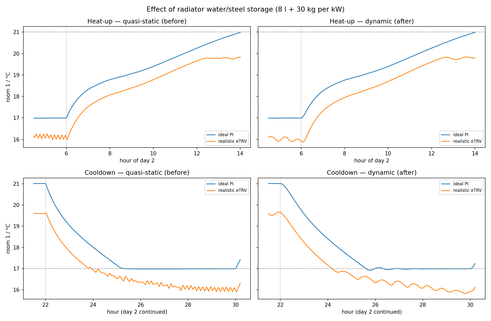
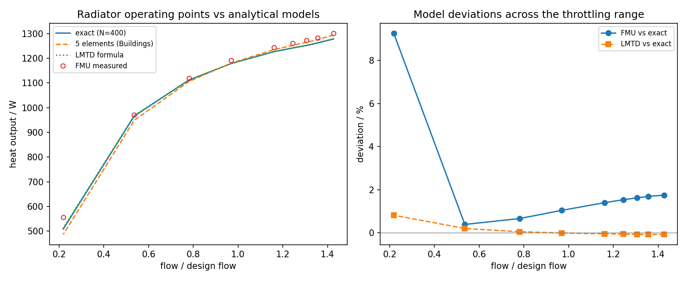

# Radiator modeling — formulation, parameters, and validation

The radiators use `Buildings.Fluid.HeatExchangers.Radiators.RadiatorEN442_2`
([model documentation](https://simulationresearch.lbl.gov/modelica/releases/latest/help/Buildings_Fluid_HeatExchangers_Radiators.html);
library: [Wetter et al. 2014](https://doi.org/10.1080/19401493.2013.765506)).

## 1. Formulation: element-wise EN 442 power law

The water path is discretized into $N = 5$ elements. Each element $i$ transfers

$$\dot Q_i \;=\; \frac{UA}{N}\,\mathrm{sign}(\Delta T_i)\,\lvert\Delta T_i\rvert^{\,n},
\qquad n = 1.24,$$

on its **local** overtemperature $\Delta T_i = T_{w,i} - T_{room}$, split into a
convective share $(1-f_{rad})$ delivered to the zone **air node** and a radiant share
$f_{rad} = 0.35$ delivered to the zone **mass node** (surfaces). $UA$ is calibrated
implicitly at initialization so the element chain reproduces the rating point exactly.

This is neither the arithmetic-mean simplification nor an explicit logarithmic-mean
formula: because the discretization resolves the falling water-temperature profile, the
effective mean overtemperature *emerges from integration* and converges to the exact
continuous solution of $\dot m c_p\, dT = -UA'\,(T - T_{room})^n\, dx$.

## 2. Parameters in this project

| Parameter | Generic building | Building80s | Rationale |
|---|---|---|---|
| Rating $T_a/T_b/T_{air}$ | 60/40/20 °C | **90/70, room design temp** (20 °C, bath 24 °C) | era-correct sizing; rating at the room's own design temperature avoids the EN 442 derating error for the 24 °C bath |
| $\dot Q_{nom}$ | 5.1 kW/apartment | per room from the §4 load tables × 1.3, incl. hall-door loss | docs/building80s-parameters.md |
| $n$ | 1.24 | 1.24 | EN 442-2 typical panel-radiator exponent |
| $f_{rad}$ | 0.35 | 0.35 | Buildings default; radiant share → mass node |
| Energy balance | dynamic | dynamic | water + steel storage per element, see §3 |
| $V_{Wat}$, $m_{Dry}$ | 8 l/kW, 30 kg/kW | 8 l/kW, 30 kg/kW | era steel/DIN radiators (see §3) |
| Flow direction | forward-only | forward-only | pump-driven branches; removes reverse-mixing states |

## 3. Energy dynamics: water/steel storage and the emission lag

Since the field-realism revision the radiator carries a **dynamic energy balance**
(`energyDynamics = FixedInitial`): each of the 5 elements stores heat in its water
volume plus the lumped steel mass,

$$V_{Wat} = 8\ \mathrm{l/kW}, \qquad m_{Dry} = 30\ \mathrm{kg/kW}$$

— chosen for 1980s steel/DIN members, which hold noticeably more water than modern
flat panels (≈ 8–13 l/kW vs ≈ 3–6 l/kW; the Buildings library defaults of
5.8 l/kW + 26.3 kg/kW describe a generic modern radiator). The resulting per-kW
capacity is $C_{rad} \approx 8\,\mathrm{kg}\cdot 4186 + 30\,\mathrm{kg}\cdot 500
\approx 48\ \mathrm{kJ/K}$, giving an **emission time constant**
$\tau_e = C_{rad}/(\dot Q/\Delta\theta) \approx$ **30–50 min** at operating
overtemperature — and longer as the radiator cools, since the EN 442 law is
degressive ($n > 1$).

Why this matters (field signatures the quasi-static model could not produce):

1. **Setpoint overshoot after the morning boost.** During recovery the radiator set
   of an apartment holds several MJ above room temperature (e.g. ≈ 250 kJ/K × 30 K
   ≈ 7 MJ for the 5.1 kW generic apartment). When the thermostat closes the valve at
   setpoint, that energy is already on the *room side* of the valve and keeps
   emitting for $\mathcal{O}(\tau_e)$ — against the fast-node capacity of
   2.6 MJ/K an overshoot of order 1 K that **no valve-side controller can fully
   prevent**. Real measurements show it almost always; a quasi-static radiator never
   does.
2. **Cushioned first cooldown hour.** At the evening setback the radiators and
   risers are at operating temperature and keep feeding the rooms while they cool,
   roughly halving the initial cooling rate and stretching the descent to the night
   setpoint toward the measured cooldown:heat-up duration ratio of ≈ 3:1.
3. **TRV limit cycles.** The emission lag adds phase lag inside the valve→room loop —
   the classic destabilizing element of TRV control
   ([Tahersima et al. 2013](https://doi.org/10.1016/j.enbuild.2013.04.019)). The
   previous steady-state balance made simulated limit cycles *milder* than reality
   (documented as a caveat in dynamics-assumptions.md §3, now resolved).

**Measured effect** (A/B against the quasi-static build, identical scenario):

*Fig. 1 — Heat-up (top) and cooldown (bottom) with quasi-static (left) vs dynamic
(right) radiators, measured at the pre-night-mass calibration (C_mass = 260); the
signatures persist at 450. With storage: S-start at the boost, radiator power
decaying over ≈ 1.5 h after the 22:00 setback, the ideal PI
undershooting-and-wobbling at the night setpoint against the emission lag, and the
eTRV's fast sawtooth chatter turning into the slow charge/discharge cycles seen in
field recordings. Signature shifts at that revision: overheating +25 % (ideal) /
+40 % (eTRV), radiator flow CV 0.80 → 1.07, burner starts 83 → 73 per day.*

**Numerical history:** the radiator originally ran steady-state because water states
at trickle flows destabilized the co-simulation solver. That failure mode was since
removed by the TRV leakage floor (0.15 % of $K_{vs}$), forward-only flow and the
steady-state pump volume. Re-enabling the storage surfaced one further interaction:
the valve actuator's in-FMU stroke filter states became entangled with the branch
pressure drops through OpenModelica's index reduction (a dynamic state set spanning
`dpVal`, `actPos` and the pump speed), which failed whenever valves moved off their
seats at trickle flow. Resolution: the radiator got its real hydraulic drop
(`dp_nominal` = 500 Pa) and the 60 s stroke moved to a harness-side rate limit
(diagnostic reproduction: `sil/probe_raddyn.py`; A/B evidence:
`sil/compare_radiator_dynamics.py`).

## 4. Validation: operating points vs the logarithmic overtemperature model

`sil/run_radiator_check.py` sweeps one radiator (living room, floor 2, rating 1742 W at
90/70/20) through a nine-step TRV staircase in the FMU and compares every measured
steady operating point — at identical boundary conditions, including the riser-loss
corrected inlet temperature — against three analytical references:

- **exact**: continuous solution with $N = 400$ elements, UA calibrated at the rating point;
- **LMTD**: $\dot Q = \dot Q_{nom}\,\big(\Delta\theta_{log}/\Delta\theta_{log,nom}\big)^{n}$
  with $\Delta\theta_{log} = (T_{sup}-T_{ret})\,/\,\ln\!\frac{T_{sup}-T_{room}}{T_{ret}-T_{room}}$,
  solved simultaneously with $\dot Q = \dot m c_p (T_{sup}-T_{ret})$;
- **5-element**: a Python replica of the Buildings discretization.

*Fig. 2 — Left: measured FMU points on the three analytical curves. Right: deviations
across the throttling range.*

| Comparison | Range | Max deviation |
|---|---|---|
| FMU vs exact integral | full → ~37 % of design flow | **0.4–1.8 %** |
| LMTD vs exact integral | entire staircase | **≤ 0.8 %** |
| FMU at ~15 % of design flow | trickle | +9.3 % — rig artifact* |

The systematic +1–2 % of the FMU stems from the two-node zone: the radiant fraction
sees the (slightly warmer) mass node, while the analytical rig uses the measured air
temperature as the single room temperature. *The low-flow point is dominated by the
measurement conditions (multi-hour radiator residence time — longer still with the
water/steel storage; the room still drifting during the 2-hour hold), not by the
radiator equations.

**Conclusion:** the Buildings 5-element discretization is consistent with the
logarithmic-overtemperature model over the full TRV throttling range; the operating
points of the verified building sit on the analytical characteristic.

## 5. Why this matters at low flows

At deep throttling the water-side spread widens and the radiator gain
$\partial\dot Q/\partial\dot m$ becomes very large — the mechanism behind the classic
TRV limit-cycling at low demand
([Tahersima et al. 2013](https://doi.org/10.1016/j.enbuild.2013.04.019)) and one root of
the oscillation signatures documented in
[building80s-parameters.md §8](building80s-parameters.md). Arithmetic-mean radiator
models overpredict output in exactly this regime; the discretized/log-mean formulation
does not.

## References

- EN 442-2: *Radiators and convectors — Part 2: Test methods and rating*.
- M. Wetter, W. Zuo, T.S. Nouidui, X. Pang: *Modelica Buildings library*, Journal of
  Building Performance Simulation 7(4), 2014.
  [doi:10.1080/19401493.2013.765506](https://doi.org/10.1080/19401493.2013.765506)
- F. Tahersima, J. Stoustrup, H. Rasmussen: *An analytical solution for
  stability-performance dilemma of hydronic radiators*, Energy and Buildings 64 (2013).
  [doi:10.1016/j.enbuild.2013.04.019](https://doi.org/10.1016/j.enbuild.2013.04.019)
- Heat-up phase behavior building on this model: [heatup-dynamics.md](heatup-dynamics.md).
