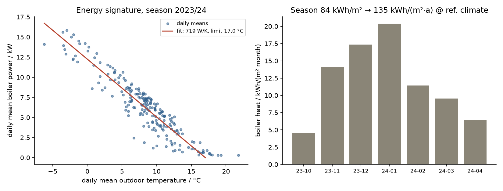

# TABULA season validation: annual consumption vs archetype statistics

> [!NOTE]
> **AI-generated content.** This document and the scripts behind it were
> produced with Claude (Anthropic) acting as a coding agent under human
> direction and review. See the repository README for the full disclaimer.

Second external validation rung (after the [BOPTEST controller
benchmark](boptest-benchmark.md)), this time aimed at the **building model
itself**: does a full heating season under real weather and era-authentic
operation land inside the *measured* consumption statistics for exactly this
building archetype? Every prior verification tested point targets (design
day, cooldown corridor, oscillation signatures); this one tests the
integrated quantity a reviewer will ask about first — kWh/(m²·a).

## 1. Reference: TABULA/IWU archetype MFH_G

The IWU German building typology (TABULA, `DE.N.MFH.07.Gen`) publishes for
multi-family houses of 1979–1983, per m² heated living area and year at the
German reference climate:

| quantity | kWh/(m²·a) |
|---|---:|
| net space heat demand, standard calculation | 139.8 |
| net space heat, adapted to the *typical measured consumption* level | 115.2 |

The 18 % gap between the two is the empirically calibrated **prebound
effect** (adaptation factor ≈ 0.82 at this consumption level, from
ratio-of-measured-to-calculated studies on 1,702 buildings, IWU 2006;
Sunikka-Blank & Galvin 2012): real buildings of this class consume *less*
than the standard calculation because real operation is not the normative
assumption. A building model intended to be field-realistic should therefore
land near the **measured** level — not near the standard calculation.

## 2. Method

One 213-day season (2023-10-01 … 2024-04-30), `Building80s`, era-authentic
normal operation ([run_tabula_season.py](../sil/run_tabula_season.py)):

- **Measured weather**: DWD station Rheinstetten 04177 (~6 km from
  Karlsruhe), hourly temperature + 10-min global/diffuse radiation
  ([data/weather/](../data/weather/), CC BY 4.0, "Quelle: Deutscher
  Wetterdienst"; fetched by
  [fetch_dwd_weather.py](../scripts/fetch_dwd_weather.py)). Facade solar
  gains from *measured* irradiance via pvlib DNI separation + transposition
  — the clear-sky/cloudiness synthesis is bypassed.
- **Era operation**: realistic eTRVs everywhere (sensor bias, backlash,
  sampled control), constant occupant setpoints 20/20/20/24 °C, cycling
  two-point boiler on the 90/70 curve with **Nachtabsenkung** (−15 K,
  22:00–05:00) and Schnellaufheizung morning boost, stochastic internal
  gains and window events, manual valves fully open (unbalanced as-built).
- **Climate normalization** by degree-day ratios (GTZ 20/15, VDI 3807):
  season → full weather year (×1.045) → long-term German reference
  GTZ 3883 K·d/a (×1.539 — 2023/24 was a record-mild year, see §5).

Quantity mapping: radiator emission Σ∫QRad ↔ TABULA *net space heat*;
boiler output ∫QBoi = net + distribution losses. DHW and combustion losses
are outside the model, so the comparison is made at the net level.

## 3. Results

Full numbers in [results/tabula_season.json](../results/tabula_season.json);
analysis by [analyze_tabula_season.py](../sil/analyze_tabula_season.py).

| quantity | value |
|---|---:|
| season boiler heat (site climate, Oct–Apr) | 83.8 kWh/m² |
| season radiator emission | 68.2 kWh/m² |
| distribution loss (risers, uninsulated era) | 18.5 % |
| **net space heat, annualized @ reference climate** | **109.8 kWh/(m²·a)** |
| boiler heat, annualized @ reference climate | 134.7 kWh/(m²·a) |
| vs TABULA measured-consumption level (115.2) | **95.3 %** |
| vs TABULA standard calculation (139.8) | 78.5 % |
| energy-signature slope | 719 W/K |
| heating-limit temperature (signature fit) | 17.0 °C |
| burner starts (season mean) | 49.5 /day |
| mean room temperature | 20.8 °C |



## 4. Findings

1. **The model lands on the measured-consumption level, not the standard
   calculation** — 95 % of the TABULA measured level, 21 % below the
   standard calculation, with nothing tuned toward either number. The
   prebound gap *emerges* from the physics plus era-authentic operation:
   central night setback on a heavy envelope, a 17 °C heating limit (the
   standard assumes continuous normative conditioning), measured rather
   than normative solar, and rooms floating above setpoint through the
   shoulder season (mean 20.8 °C, TRVs shut).
2. **The energy signature is self-consistent with the design-day
   verification.** The fitted slope of 719 W/K sits just below the
   design-derived envelope+ventilation conductance (~780 W/K at 65 W/m² /
   32 K) — as it should, since the signature is net of solar gains that
   correlate with outdoor temperature. The 17.0 °C heating limit matches
   the German rule-of-thumb Heizgrenze for unrenovated MFH (15–17 °C).
3. **Distribution losses of 18.5 %** (boiler output vs radiator emission)
   fall in the DIN V 18599-5 range for uninsulated-era in-envelope
   distribution — a quantity never calibrated, produced by the riser model.
4. **Secondary plausibility check at the delivered-energy level**: assuming
   an era boiler efficiency of ~0.84 (HHV), delivered space-heat gas would
   be ≈ 160 kWh/(m²·a) — consistent with the TABULA measured delivered
   energy minus a typical DHW share (191.6 − ~30 ≈ 160). Two stacked
   assumptions, so this is a plausibility note, not a claim.

## 5. Validation boundary

- **The climate adjustment is the largest lever.** 2023/24 was
  exceptionally mild (site GTZ 2524 vs reference 3883 K·d → factor 1.54),
  and linear degree-day scaling over that distance is an approximation
  (solar and internal-gain shares do not scale with GTZ). Sensitivity:
  ±5 % on the reference GTZ moves the net result ±5.5 kWh/(m²·a) —
  the conclusion "at or below the measured level, clearly below the
  standard calculation" holds across the plausible range (GTZ_ref
  3700–4100 → 92–102 % of the measured level).
- VDI 3807 GTZ and the TABULA reference climate (DIN V 18599-10) are not
  the identical construct; the comparison is archetype-statistical, not
  building-specific.
- One weather year, one stochastic-gains realization, no vacancy, no user
  ventilation beyond window events; DHW and combustion excluded (net-level
  comparison by design).
- This rung validates the **integrated energy behavior** of the plant
  model. It does not validate room-resolved dynamics against measured
  data — that is the Twin-House rung (IEA EBC Annex 58/71), still open.

## 6. Reproduction

```bash
python scripts/fetch_dwd_weather.py            # DWD CDC download (~1 min)
# in the WSL/Docker toolchain:
python3 sil/run_tabula_season.py 0 213 full 60 # 213-day season (~45 min)
python3 sil/analyze_tabula_season.py full      # JSON + figure + comparison
```

Sources: IWU/TABULA DE typology brochure 2015 (MFH_G tables, adaptation
factors); TABULA CommonCalculationMethod (f_adapt); Sunikka-Blank & Galvin,
BR&I 40(3) 2012 (prebound effect); VDI 3807-1 (degree days); DWD CDC open
data (station 04177).
