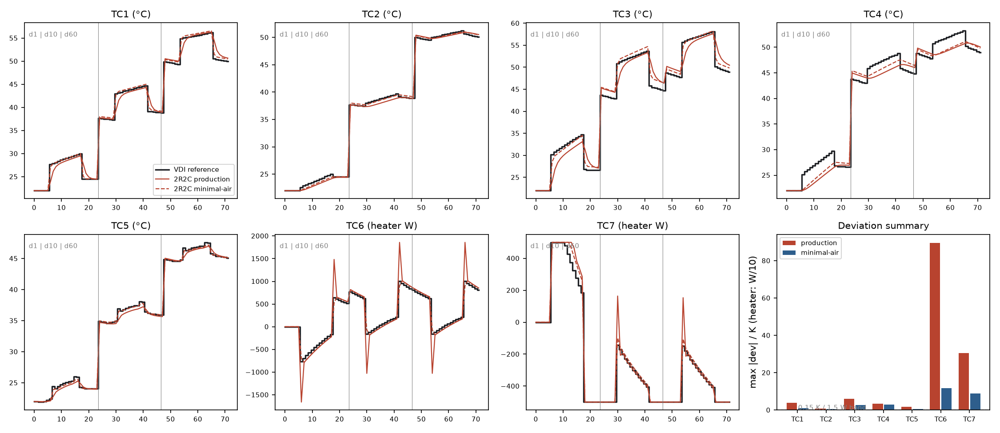

# VDI 6007-1 test cases: the production 2R2C zone vs the guideline

> [!NOTE]
> **AI-generated content.** This document and the scripts behind it were
> produced with Claude (Anthropic) acting as a coding agent under human
> direction and review. See the repository README for the full disclaimer.

Building-model integrity, rung 2a (after the [TABULA season
corridor](tabula-season-validation.md)): the room-model methodology itself,
tested against VDI 6007 Blatt 1 — *the* German standard test suite for
reduced-order thermal room models. Twelve cases with near-analytical
reference trajectories; the no-solar-processing subset TC1–TC7 is run here
(hourly indoor-temperature or heater-power means on days 1/10/60 of a
60-day excitation).

**This is a diagnostic comparison, not a compliance claim.** The guideline
band (0.1 K / 1 W) certifies implementations *of the VDI two-element
algorithm*; our zone is a deliberately simpler structure. The value of the
exercise is measuring exactly what the simplification costs, and where.

## 1. Test data and rig

Cases, parameters and reference trajectories come from the open-source
AixLib implementation (RWTH-EBC/AixLib, BSD-3), extracted by
[fetch_vdi6007_cases.py](../scripts/fetch_vdi6007_cases.py) into
[data/vdi6007/cases.json](../data/vdi6007/cases.json) — no guideline
purchase required. The rig
([VDI6007ZoneTest.mo](../modelica/VDI6007ZoneTest.mo)) is the
`ApartmentBranch` zone network extracted verbatim: air node (C_air) and
structural mass node (C_mass), G_int between them, G_wall mass→out,
G_win air→out, convective heat to air, radiative heat to mass — plus the
AixLib test-case heater construct (PI k=0.1/Ti=4, scaled; ideal for TC6,
±500 W for TC7).

## 2. Parameter mapping (VDI network → 2R2C)

The VDI reference model is *not* a plain 2R2C: two storage chains
(interior/exterior), massless surface nodes with separate convective films,
a radiative star, and **zero air capacitance**. The mapping
([fetch_vdi6007_cases.py](../scripts/fetch_vdi6007_cases.py)):

1. **Kron-reduce** the massless surface nodes exactly →
   G_int = g(air↔CInt) + g(air↔CExt). The radiative-star path
   (air → interior surface → star → exterior wall → out) is thereby
   *included* — dropping it, as a naive per-chain series sum does,
   underestimates transmission by ~23 %.
2. **Lump** CInt + CExt → C_mass (the 2-storage-state → 1 reduction).
3. **Preserve the exact steady-state transmission**: G_wall solved from
   the fully reduced air→out conductance G_ss (TC1: 15.97 W/K; rig
   verified: 90-day steady state 53.31 °C vs analytic 53.3).

Two C_air variants per case: **production** (40 kJ/(m²K) × 17.5 m² =
0.70 MJ/K — the furnished-room fast node exactly as in Building80s) and
**minimal-air** (63 kJ/K, bare room air) — the latter isolates the
topology cost, since the guideline's air is massless.

## 3. Results

Max |deviation| of hourly means across all three scoring windows
([results/vdi6007_results.json](../results/vdi6007_results.json)):

| case | excitation | production | minimal-air | AixLib band |
|---|---|---:|---:|---:|
| TC1 | convective 1 kW square, heavy room | 3.86 K | 0.92 K | 0.15 K |
| TC2 | radiative 1 kW square, heavy | 0.85 K | 0.59 K | 0.15 K |
| TC3 | convective, lightweight | 6.10 K | 2.59 K | 0.15 K |
| TC4 | radiative, lightweight | 3.48 K | 3.03 K | 0.15 K |
| TC5 | real-day mix: variable T_out, persons/machines, window solar + sunblind | **1.71 K** | **0.55 K** | 0.15 K |
| TC6 | ideal heater/cooler, setpoint 22↔27 °C | 896 W | 117 W | 1.5 W |
| TC7 | heater capped ±500 W | 306 W | 90 W | 1.5 W |



## 4. Findings

1. **Steady-state and integral energy behavior: exact by construction** —
   the mapping preserves G_ss, and the day-60 plateaus sit on the
   reference in every temperature case. Consistent with the TABULA rung:
   the model's *energy* claims don't depend on the structural
   simplification.
2. **The pure topology cost (minimal-air) is 0.4–3 K**, ordered by
   construction class: heavyweight rooms 0.6–0.9 K (the lumped CInt+CExt
   approximation is good when one capacity dominates), lightweight 2.6–3 K
   (CExt is tiny, the two VDI storage chains separate dynamically, and one
   mass node can't track both). On the only *realistic* excitation (TC5:
   weather day, mixed gains, sunblind) it is **0.55 K**.
3. **The production deviations are dominated by the deliberate fast node,
   and they concentrate in square-wave step hours.** VDI prescribes
   massless air; our C_air = 0.70 MJ/K absorbs/releases ≈ C_air·ΔT in the
   hour of each 1 kW gain edge or 5 K setpoint step — TC6's 896 W max
   deviation is mechanically C_air·5 K/3600 s ≈ 970 W. Between steps the
   trajectories run parallel to the reference. On realistic smooth
   excitation (TC5) the production zone stays within 1.7 K.
4. **Radiative injection into the mass node is the right convention**:
   the radiative cases (TC2/TC4) are systematically closer than their
   convective twins — the production wiring (radiator radiative fraction
   and 70 % of solar to mass) matches how the reference distributes
   radiative gains onto surfaces.

Verdict for the model card: the 2R2C zone reproduces the guideline
reference within ≈ 0.5–1.7 K on realistic excitations and within 3 K
(heavy) / 6 K (light) on the artificial square-wave cases, with the
excess over the topology floor attributable to the field-calibrated
furnished-room fast node — a documented divergence from the guideline's
massless-air convention, not an implementation error. Rooms in
Building80s are heavyweight (masonry/concrete), i.e. on the favorable
side of finding 2.

## 5. Reproduction notes (the traps)

```bash
python scripts/fetch_vdi6007_cases.py      # extract cases from AixLib
# WSL/Docker toolchain:
omc modelica/build_vdi_rig.mos             # MSL-only FMU, ~20 s
python3 sil/run_vdi6007.py                 # 14 runs, ~2 min
```

Learned the hard way from the AixLib rigs: (a) gain/reference tables
mix step encodings — duplicated breakpoints, micro-ramps (`21600.1`),
and linear segments; sample *just after* the hour edge; (b) TC5 has a
**sunblind** (g → 0.15 above 100 W/m² — easy to miss, worth +30 K if
ignored); (c) the heat-flow-sensor sign conventions differ between TC6
and TC7 (TC7 flips via a −1 gain); (d) the reference tables' 273.15
offset must not leak into neighboring tables when parsing.
